# EVA01: Unified Native 3D Understanding and Generation via Mixture-of-Transformers

<p align="center">
  <a href="https://github.com/SeeleAI/OpenEVA"></a>
  <a href="https://huggingface.co/SEELE-AI/EVA01-2B-Instruct"></a>
  <a href="https://huggingface.co/SEELE-AI/EVA01-2B-Instruct-LoRA"></a>
  <a href="https://www.seeles.ai/research/pages/EVA01"></a>
  <a href="https://arxiv.org/abs/2605.16745"></a>
  <a href="../LICENSE"></a>
</p>

<p align="center">
  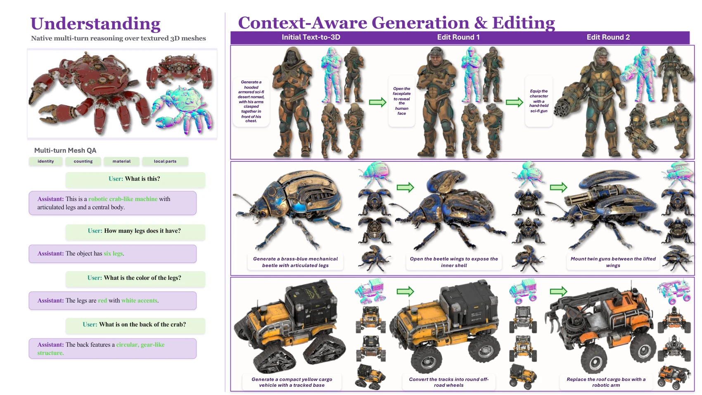
</p>

EVA01 is a unified native 3D framework for mesh understanding, shape generation, and context-aware editing. It integrates 3D meshes as a native modality through a Mixture-of-Transformers architecture with an Understanding Expert, a structurally mirrored Generation Expert, shared global self-attention, and hard modality routing.

## ✨ Release Status

| Item | Status |
| --- | --- |
| UND-side Full checkpoint | 🟢 [`SEELE-AI/EVA01-2B-Instruct`](https://huggingface.co/SEELE-AI/EVA01-2B-Instruct) |
| UND-side LoRA checkpoint | 🟢 [`SEELE-AI/EVA01-2B-Instruct-LoRA`](https://huggingface.co/SEELE-AI/EVA01-2B-Instruct-LoRA) |
| Data release | 🟣 Planned. |

*Full and LoRA checkpoints are trained with alignment followed by instruction tuning.*

## ⚡ Install

The install script targets a clean Ubuntu-like machine. It bootstraps `uv`, creates `EVA01/.venv`, installs a current PyTorch wheel, and installs EVA01 in editable mode.

```bash
cd EVA01
bash install.sh
source .venv/bin/activate
```

If a different CUDA wheel index is required, set `TORCH_INDEX_URL` before running the script.

```bash
TORCH_INDEX_URL=https://download.pytorch.org/whl/cu121 bash install.sh
```

## 🚀 Quick Inference

Full checkpoint:

```bash
python infer.py \
  --checkpoint SEELE-AI/EVA01-2B-Instruct \
  --mesh assets/examples/construction_backhoe.glb \
  --question "Describe this 3D object in detail."
```

LoRA checkpoint:

```bash
python infer.py \
  --checkpoint SEELE-AI/EVA01-2B-Instruct-LoRA \
  --mesh assets/examples/construction_backhoe.glb \
  --question "Describe this 3D object in detail."
```

Python API:

```python
import torch
from eva01 import EVA01ForConditionalGeneration, EVA01Processor

model = EVA01ForConditionalGeneration.from_pretrained(
    "SEELE-AI/EVA01-2B-Instruct",
    torch_dtype=torch.bfloat16,
    device_map="auto",
)
processor = EVA01Processor.from_pretrained("SEELE-AI/EVA01-2B-Instruct")

messages = [{
    "role": "user",
    "content": [
        {"type": "mesh", "mesh": "assets/examples/construction_backhoe.glb"},
        {"type": "text", "text": "Describe this 3D object in detail."},
    ],
}]

inputs = processor.apply_chat_template(
    messages,
    tokenize=True,
    add_generation_prompt=True,
    return_dict=True,
    return_tensors="pt",
).to(model.device)

output_ids = model.generate(**inputs, max_new_tokens=128, do_sample=False)
text = processor.batch_decode(
    output_ids[:, inputs.input_ids.shape[1]:],
    skip_special_tokens=True,
    clean_up_tokenization_spaces=False,
)[0]
print(text)
```

For the LoRA release, load `SEELE-AI/EVA01-2B-Instruct-LoRA` through the same API. If a local Qwen3-VL base checkpoint is preferred, pass it through `base_model_name_or_path`.

```python
model = EVA01ForConditionalGeneration.from_pretrained(
    "SEELE-AI/EVA01-2B-Instruct-LoRA",
    base_model_name_or_path="/path/to/Qwen3-VL-2B-Instruct",
    torch_dtype=torch.bfloat16,
    device_map="auto",
)
processor = EVA01Processor.from_pretrained("SEELE-AI/EVA01-2B-Instruct-LoRA")
```

The public mesh token is `<|mesh_und_pad|>`. The processor returns `input_ids`, `attention_mask`, and `mesh_und_values`.

## 💬 Gradio Chat

```bash
python app.py --host 127.0.0.1 --port 7860
```

The app loads the Full checkpoint by default, supports uploaded `.glb` files, and includes 10 built-in TexVerse examples.

## 📐 PointLLM-200 Evaluation

The eval script downloads PointLLM-200 benchmark files staged in the Full checkpoint repo and writes results under `EVA01/outputs/pointllm200/`.

```bash
python eval_pointllm200.py --variant full
python eval_pointllm200.py --variant lora
```

The deterministic path computes BLEU, ROUGE, METEOR, Sentence-BERT, and SimCSE with fixed seed `20260615` and greedy generation. Add `--with-gpt` to run GPT-ref and GPT-img when `OPENAI_API_KEY` is available.

```bash
OPENAI_API_KEY=... python eval_pointllm200.py --variant full --with-gpt
OPENAI_API_KEY=... python eval_pointllm200.py --variant lora --with-gpt
```

`OPENAI_JUDGE_MODEL` or `--gpt-model` selects the judge model. GPT-ref compares the model caption to the human caption. GPT-img judges the model caption against staged Blender PBR four-view renders produced from the original `.glb` assets under `benchmark/pointllm200/renders_blender_pbr/`. Use `--render-dir` to point to a different PBR render directory.

SimCSE loading with recent `transformers` releases requires `torch>=2.6` when the cached semantic model is stored as PyTorch `.bin` weights. The install script installs a current PyTorch wheel.

The PointLLM-200 benchmark source is cited as [`RunsenXu/PointLLM`](https://huggingface.co/datasets/RunsenXu/PointLLM).

## 🏁 Metrics

All metrics below are reported on PointLLM-200 with 200 samples, fixed seed `20260615`, and greedy decoding. GPT-ref and GPT-img are judge metrics and may vary with judge model and API settings.

| Model | B-1 | B-4 | R-L | METEOR | SBERT | SimCSE | GPT-ref | GPT-img |
| --- | ---: | ---: | ---: | ---: | ---: | ---: | ---: | ---: |
| PointLLM-13B | 7.873 | 0.649 | 10.519 | 13.620 | 47.539 | 48.602 | 51.735 | 49.745 |
| ShapeLLM-13B | 10.542 | 1.050 | 12.954 | 14.234 | 39.935 | 40.728 | 33.925 | 35.870 |
| ShapeLLM-Omni | 11.326 | 1.197 | 14.190 | 13.276 | 34.617 | 35.115 | 25.625 | 20.190 |
| EVA01-2B-Instruct | 6.386 | 0.589 | 9.443 | 13.505 | 50.651 | 50.767 | 59.045 | 70.335 |
| EVA01-2B-Instruct-LoRA | 6.372 | 0.607 | 9.455 | 13.567 | 51.194 | 51.320 | **59.560** | **71.480** |

GPT-ref uses the original reference-judge run. GPT-img uses staged Blender PBR GLB renders in `benchmark/pointllm200/renders_blender_pbr/`.

## 🖼️ Gallery

The gallery uses 10 TexVerse GLB meshes included in `assets/examples/`. Each preview is a real Blender PBR 2x2 four-view render from the original `.glb`, ordered as front, right, back, and left. Full prompts, model answers, and GT captions are stored in `assets/examples/gallery.json`.

| Preview | Example | Q1 | A1 | Q2 | A2 | GT Caption |
| --- | --- | --- | --- | --- | --- | --- |
| 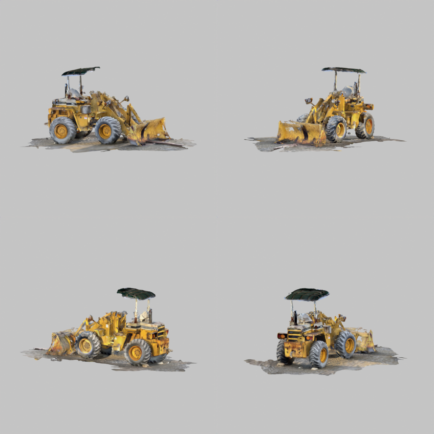 | `construction_backhoe` | Describe this 3D object in detail. | The object is a yellow construction vehicle with a large front bucket and a smaller rear bucket. It features a cabin with a windshield and a roof, an... | What work tools are mounted on the front and rear of this construction vehicle, and where are they attached? | The front and rear of the vehicle are equipped with bucket loaders, which are mounted on the front and rear for digging and lifti... | A yellow construction backhoe loader parked on a patch of dirt. The vehicle has a front loader bucket attached to a hydraulic arm, a rear digging arm folded behind, four... |
| 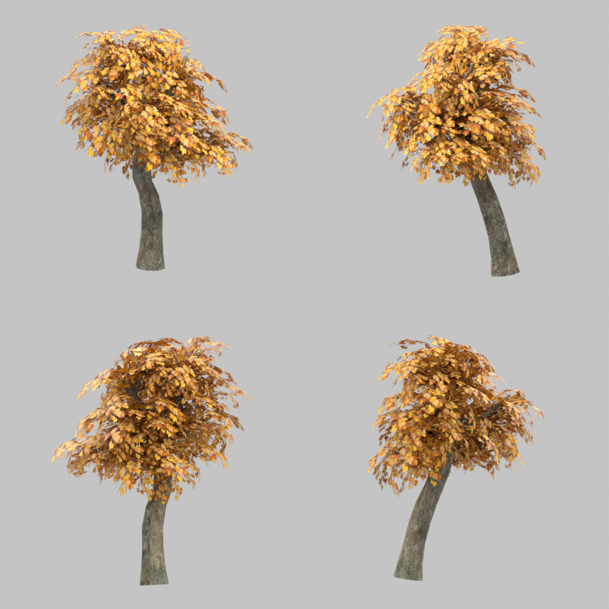 | `autumn_tree` | Describe this 3D object in detail. | The object is a tree with a thick, textured trunk and a dense canopy of yellow and orange leaves. The trunk is sturdy and has a natural, rough textur... | Which colors and structural details make this tree look like an autumn tree? | The tree has a brown trunk and branches, with leaves in shades of yellow, orange, and green, creating a vibrant autumn appearance. | A realistic 3D model of a deciduous tree in autumn. The tree consists of a thick, textured trunk at the center that branches out to support a dense canopy of leaves, whi... |
| 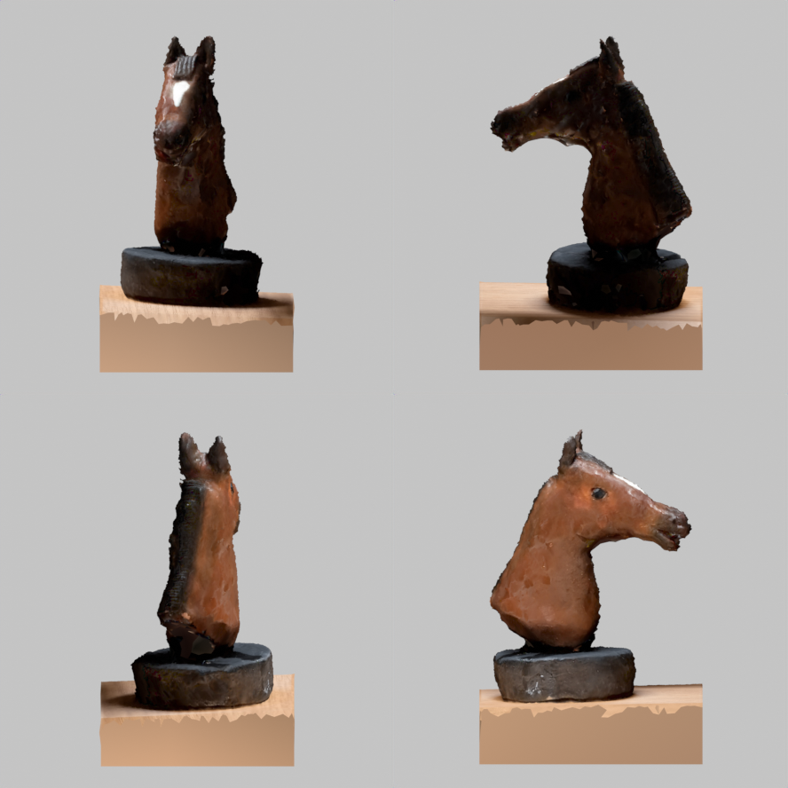 | `horse_head_sculpture` | Describe this 3D object in detail. | The object is a detailed model of a horse's head mounted on a rectangular base. The horse has a realistic texture with a brown coat and a white blaze... | What layers make up the base of this horse-head sculpture, and how do their materials differ? | The base is made of a smooth, light-colored material, contrasting with the textured, dark brown material of the horse's body. | A carved horse head sculpture mounted on a wooden base. The sculpture features the upper portion of a horse’s head attached to a round, dark pedestal, which is then fixe... |
| 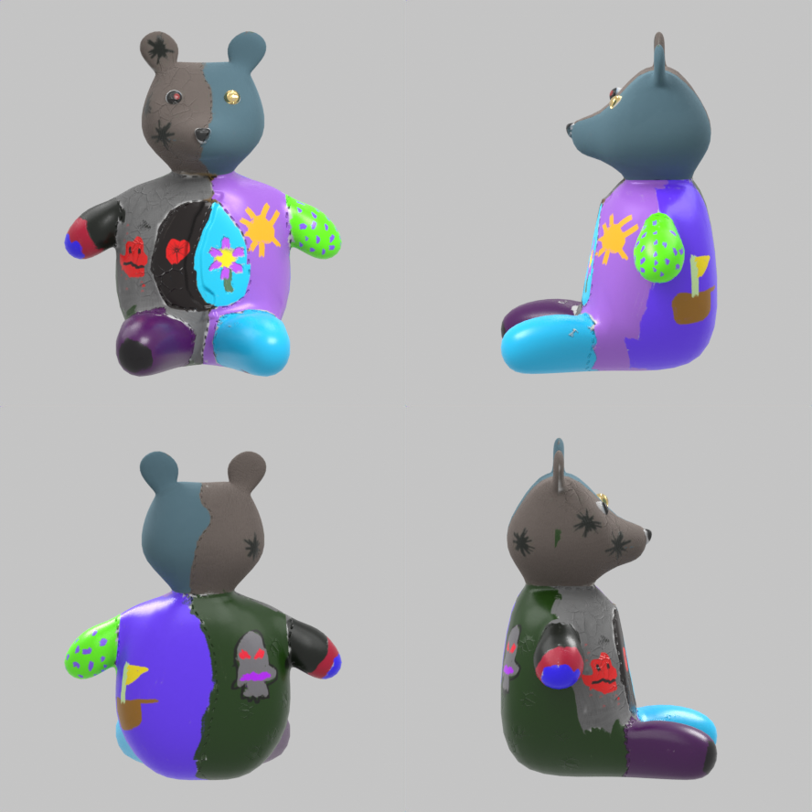 | `patchwork_teddy_bear` | Describe this 3D object in detail. | The object is a colorful, stylized bear figure with a round head, small ears, and a snout. It has a vibrant, multicolored body with distinct sections... | What visible asymmetries appear between the left and right sides of this patchwork teddy bear? | The bear has a more pronounced asymmetry with the right side featuring a larger purple patch and a prominent red patch, while the... | A colorful patchwork teddy bear figurine. The bear has a rounded head with two ears, a small snout, and two mismatched button eyes, with its body, arms, and legs made up... |
| 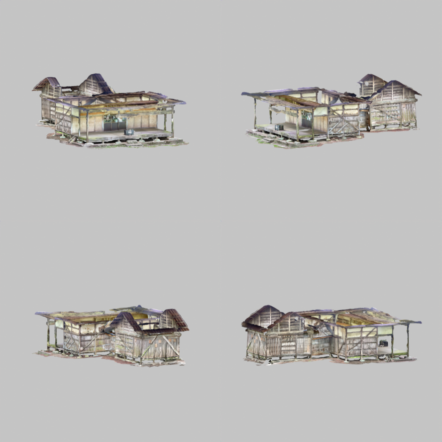 | `ruined_japanese_house` | Describe this 3D object in detail. | The object is a rustic, weathered structure with a gabled roof and a series of windows. It appears to be made of wood and has a rough, aged texture.... | Which structural details suggest this wooden house is partly ruined and weather-exposed? | The presence of exposed beams, broken windows, and a partially collapsed roof suggests the house is partly ruined and weather-exp... | A traditional Japanese-style wooden house in a partially ruined state. The structure consists of a raised wooden foundation, open walls, a partially collapsed roof with... |
| 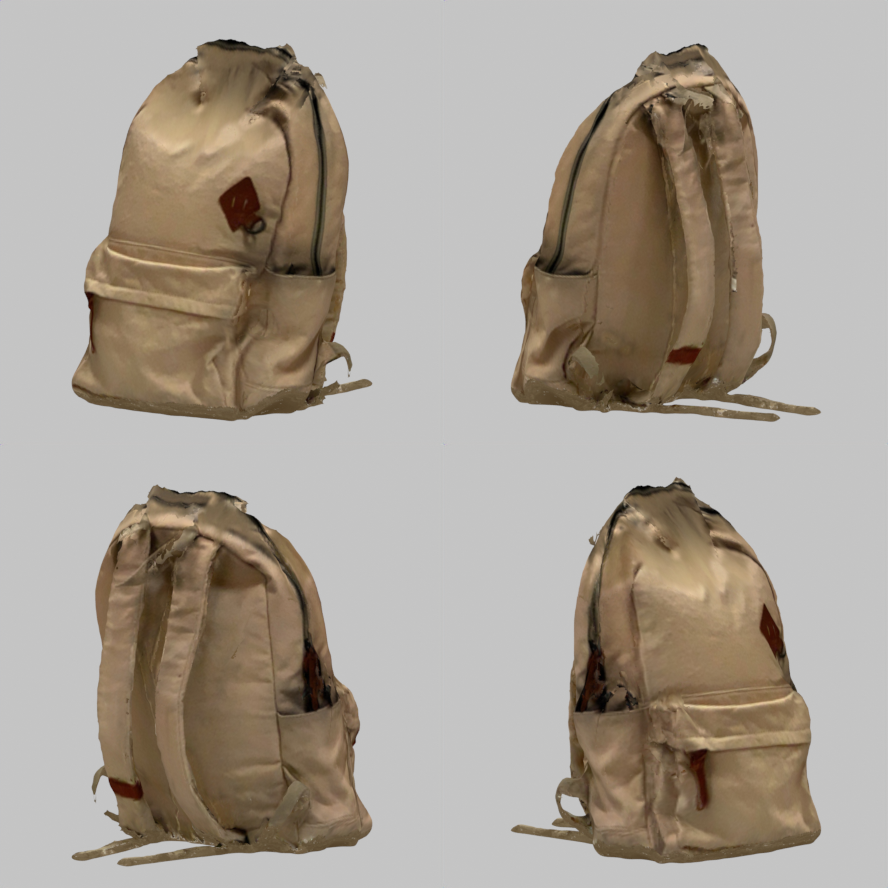 | `beige_backpack` | Describe this 3D object in detail. | The object is a backpack with a rugged, worn appearance. It features a main compartment with a flap closure and a front pocket. The backpack has mult... | What functional compartments and material details are visible on the front of this backpack? | The front of the backpack features a main compartment with a zipper, a side pocket with a flap, and a top pocket with a zipper. T... | A beige fabric backpack designed for casual or school use. The backpack has a large main compartment with a zipper closure on top, a smaller front pocket also with a zip... |
| 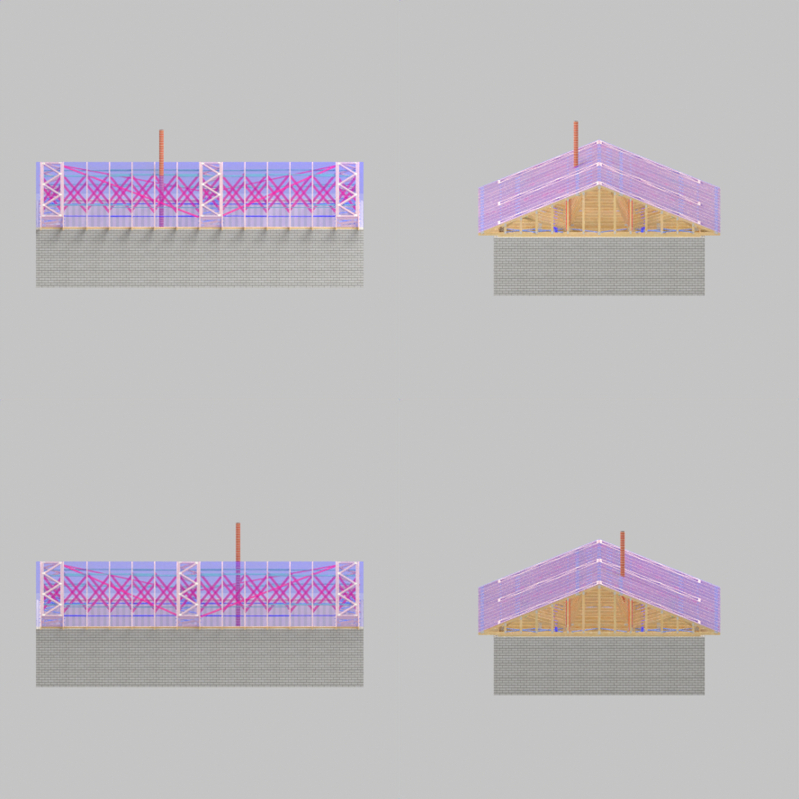 | `exposed_roof_framework` | Describe this 3D object in detail. | The object is a detailed architectural model of a building structure with a complex roof design. The roof features a combination of trusses and a cen... | Which beams, braces, posts, and chimney elements define the exposed roof framework? | The exposed roof framework is defined by beams, braces, posts, and a chimney. | A 3D model of a building structure with an exposed roof framework. The structure consists of a rectangular brick base wall with an open truss system above it, featuring... |
| 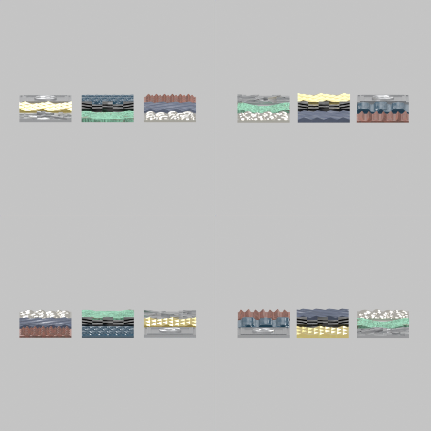 | `material_texture_grid` | Describe this 3D object in detail. | The object consists of six distinct panels, each with unique colors and textures. The panels are arranged in a grid-like formation, showcasing a vari... | How do the nine material tiles differ in surface shape, color, and apparent material? | The tiles differ in shape (rectangular, square, hexagonal), color (blue, green, orange, red, yellow, brown, gray), and apparent m... | A collection of nine square 3D material texture samples arranged in a 3x3 grid. The top row contains a silver metallic panel with irregular geometric cuts on the left, a... |
| 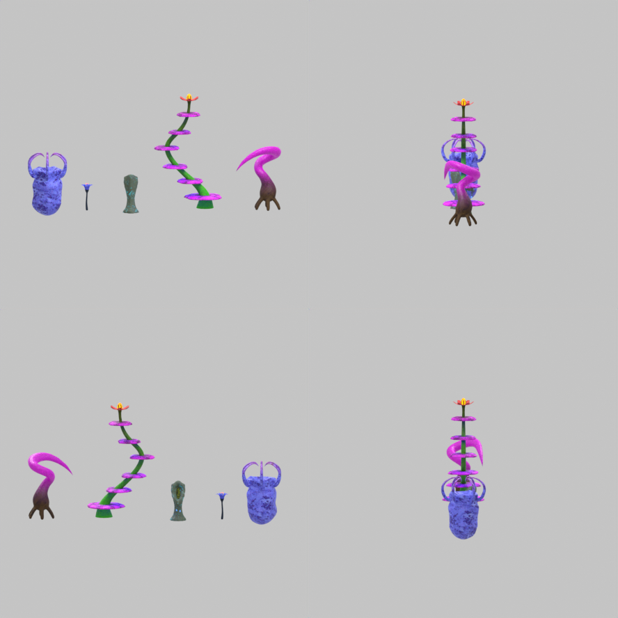 | `alien_plants` | Describe this 3D object in detail. | The object is a series of interconnected, colorful structures resembling a plant or a series of stacked cups. Each structure has a distinct color and... | What makes these plants look alien or fantastical? | The plants have exaggerated features such as large, bulbous heads, long stems, and vibrant colors, giving them an alien or fantas... | A collection of five fantastical alien plants. From left to right, the first plant has a dark brown root-like base with a glowing, curved, tentacle-shaped stem in bright... |
| 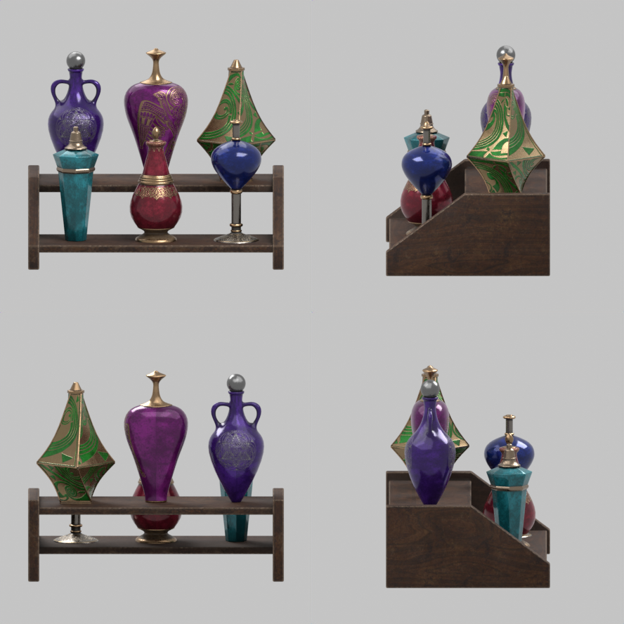 | `decorative_bottles` | Describe this 3D object in detail. | The object is a wooden shelf with a rectangular base and a flat top. It holds several bottles of various colors and shapes, including a tall bottle w... | How do the bottles differ in shape, color, and ornamentation? | The bottles differ in shape, color, and ornamentation, with some being tall and narrow, others round and bulbous, and some featur... | A collection of ornate decorative bottles displayed on a wooden shelf. The shelf holds six uniquely shaped bottles: on the top row, a purple bottle with twin handles and... |

## 📚 Citation

```bibtex
@misc{eva01_2026,
  title  = {EVA01: Unified Native 3D Understanding and Generation via Mixture-of-Transformers},
  author = {Zongyuan Yang and Mingjing Yi and Wanli Ma and Chenzhuo Fan and Bocheng Li and Baolin Liu and Yuke Lou and Yingde Song and Yongping Xiong and Zhengdong Guo and Shimu Wang},
  year   = {2026},
  eprint = {2605.16745},
  archivePrefix = {arXiv},
  primaryClass = {cs.CV}
}
```
