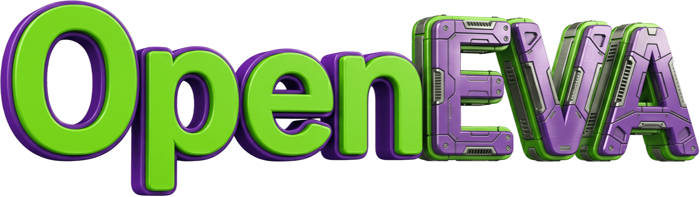

<h1 align="center">OpenEVA: A Family of Native 3D Foundation Models for both Understanding & Generation.</h1>

<p align="center">
  <a href="https://arxiv.org/abs/2605.16745"></a>
  <a href="https://huggingface.co/SEELE-AI"></a>
  <a href="https://www.seeles.ai/research/pages/EVA01"></a>
  <a href="https://github.com/SeeleAI"></a>
  <a href="https://x.com/SEELE_AI1125"></a>
  <a href="https://www.linkedin.com/company/seeleai"></a>
  <a href="LICENSE"></a>
</p>
<p align="center">
  <a href="https://hits.sh/github.com/SeeleAI/OpenEVA/"></a>
</p>

<div align="center">
  
</div>

OpenEVA is a family of native 3D foundation models for unified understanding, generation, and editing. It is the public release hub for SEELE-AI's EVA series, built around native 3D representations that connect geometry, appearance, language, and interactive creation.

## 🗞️ News

- 🟢 **2026-06-16** · OpenEVA opens the EVA01 UND-side release path with model checkpoints, inference, evaluation, and gallery assets.
- 🟣 **2026-05-16** · EVA01 appears on arXiv: [2605.16745](https://arxiv.org/abs/2605.16745).

## 🧭 Overview

OpenEVA develops native 3D models that can encode, understand, generate, and edit 3D assets across object- and scene-level settings. The series starts from aligned 3D representation learning, moves through unified understanding and generation, and targets scalable multimodal 3D intelligence for text, image, and 3D creation workflows.

## 📦 Model Zoo

| Series | Model / Asset | Status | Link | Notes |
| --- | --- | --- | --- | --- |
| EVA00 | EVA00 3D Encoder | TBA | TBA | Large pretrained 3D encoder for stronger 3D representations aligned with text and images. |
| EVA01 | EVA01-2B-Instruct | 🟢 Released | [`SEELE-AI/EVA01-2B-Instruct`](https://huggingface.co/SEELE-AI/EVA01-2B-Instruct) | UND-side Full checkpoint for native 3D understanding. |
| EVA01 | EVA01-2B-Instruct-LoRA | 🟢 Released | [`SEELE-AI/EVA01-2B-Instruct-LoRA`](https://huggingface.co/SEELE-AI/EVA01-2B-Instruct-LoRA) | UND-side LoRA checkpoint for native 3D understanding. |
| EVA01 | EVA01 Data | 🟣 Planned | TBA | Data release for EVA01 is planned. |
| EVA02 | EVA02 | TBA | TBA | Larger and stronger unified 3D generation model built upon EVA01. |

## 🗺️ Roadmap

- 🟣 Build larger and cleaner text-image-3D paired datasets for native 3D model training.
- 🟢 Train better multimodally aligned pretrained 3D encoders and 3D representations.
- 🟡 Scale toward larger unified 3D generation and understanding models for both single objects and scenes.

## 📚 Citation

```bibtex
@misc{eva01_2026,
  title  = {EVA01: Unified Native 3D Understanding and Generation via Mixture-of-Transformers},
  author = {Zongyuan Yang and Mingjing Yi and Wanli Ma and Chenzhuo Fan and Bocheng Li and Baolin Liu and Yuke Lou and Yingde Song and Yongping Xiong and Zhengdong Guo and Shimu Wang},
  year   = {2026},
  eprint = {2605.16745},
  archivePrefix = {arXiv},
  primaryClass = {cs.CV}
}
```

## 📄 License

OpenEVA is released under the [Apache-2.0 license](LICENSE).

## 🔗 Contact

<p align="center">
  
</p>

- 🌐 Project page: [seeles.ai/research/pages/EVA01](https://www.seeles.ai/research/pages/EVA01)
- 🤗 Hugging Face: [SEELE-AI](https://huggingface.co/SEELE-AI)
- 🧩 GitHub: [SeeleAI](https://github.com/SeeleAI)
- 💬 X: [SEELE_AI1125](https://x.com/SEELE_AI1125)
- 💼 LinkedIn: [SEELE-AI](https://www.linkedin.com/company/seeleai)
